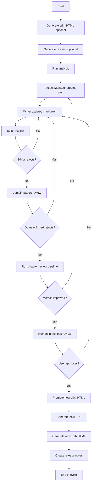

# W1 Editing Workflow Proposal

**Date:** 2024-11-23
**Author:** CEO
**Purpose:** Define the iterative editing workflow for improving books through review analysis, structured agent actions, and human oversight.

---

## Context

This workflow runs after Prework is complete. It operates on registered books, taking an input version and producing an improved output version.

### Dependencies
- **Prework complete:** Book registry, workflow lifecycle, event system, artifact sharing
- **Existing pipelines:** Personas, Reviews, HTML generation, PDF generation

---

## Goal

Improve a book through review analysis, structured agent actions, and human oversight.

---

## Workflow Diagram

---

## Process Steps

1. Optionally generate the print HTML
2. Optionally generate reviews (populate personas, run 15-50 reviews, run analysis)
3. Project Manager creates improvement plan based on analysis
4. Writer updates markdown files and reports changed chapters
5. Editor reviews changes and approves or rejects
6. Domain Expert reviews mechanical consistency and approves or rejects
7. If either agent rejects, return to Project Manager and repeat
8. If approved, run chapter-level reviews
9. Project Manager evaluates whether metrics improved
10. If not, return to review stage
11. If yes, run human review
12. If human rejects, iterate again
13. If approved, promote new print HTML
14. Generate and promote new PDF draft
15. Generate and promote new web HTML
16. Create release notes
17. Optionally generate new review set

---

## Agents

### Project Manager Agent

**Inputs:**
- Review analysis
- Chapter list
- Prior release notes

**Outputs:**
- Improvement plan
- Goal metrics

**Responsibilities:**
- Convert analysis into actionable tasks
- Define success metrics

**Data Access:**
- Reads: `data/reviews/analysis`, `books/...`, `data/project.db`
- Writes: `data/workflow/pm/*`

---

### Writer Agent

**Inputs:**
- Improvement plan
- Existing markdown files

**Outputs:**
- Updated chapters
- Change log listing modified chapters

**Responsibilities:**
- Implement improvements
- Enforce rules and style guides

---

### Editor Agent

**Inputs:**
- Updated chapters
- PM plan goals
- Style guides

**Outputs:**
- Editor review document
- Pass or fail flag

---

### Domain Expert Agent

**Inputs:**
- Updated chapters
- Persona concerns
- Rule and mechanics guides

**Outputs:**
- Review notes
- Approval status

---

## Data I/O

### Inputs
- Markdown sources (book content)
- Personas (for review generation)
- Style guides
- Print HTML (current version)
- Input version ID from `book_versions`

### Outputs
- Updated chapters (markdown)
- Updated print HTML
- Updated PDF draft
- Updated web HTML
- Release notes
- Output version ID in `book_versions`

---

## Workflow Artifacts

| Artifact Type | Description |
|--------------|-------------|
| `chapter` | Updated chapter markdown |
| `release_notes` | Summary of changes |
| `print_html` | Generated print HTML |
| `pdf_draft` | Generated PDF |
| `web_html` | Generated web HTML |

---

## Success Criteria

1. **Workflow runs end-to-end** - Can start with input version, produce output version
2. **Agent handoffs work** - PM → Writer → Editor → Domain Expert cycle functions
3. **Rejection routing works** - Rejections route back to appropriate agent
4. **Metrics tracking works** - Can measure improvement between versions
5. **Human gates work** - Human review can approve or reject
6. **Artifacts registered** - All outputs registered in workflow_artifacts

---

## Risks

1. **Long cycle times** - Multiple rejection loops could extend cycle
   - Mitigation: Set max iteration limits, escalate after N rejections

2. **Metrics gaming** - Optimizing for metrics vs actual quality
   - Mitigation: Human review as final gate

3. **Style drift** - Writer changes may diverge from style guide
   - Mitigation: Editor agent enforces style consistency

---

*This proposal is input for a W1 Boardroom session.*
