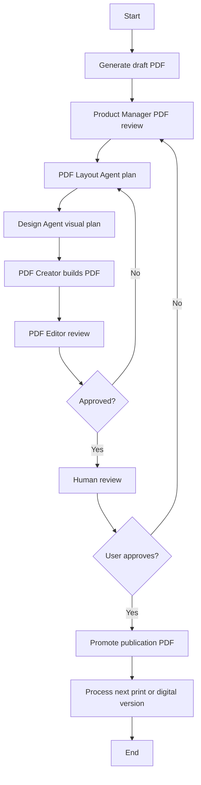

# W2 PDF Workflow Proposal

**Date:** 2024-11-23
**Author:** CEO
**Purpose:** Define the iterative PDF workflow for producing publication-quality digital and print PDFs.

---

## Context

This workflow runs after W1 produces updated content. It takes W1's artifacts (release notes, updated content) and produces publication-ready PDFs.

### Dependencies
- **Prework complete:** Book registry, workflow lifecycle, event system, artifact sharing
- **W1 artifacts:** Release notes, updated print HTML
- **Existing pipelines:** PDF generation at `src/tooling/pdf-gen`

---

## Goal

Produce publication-quality digital and print PDFs for distribution.

---

## Workflow Diagram

---

## Process Steps

1. Generate draft PDF from W1 artifacts
2. Product Manager reviews draft and release notes
3. PDF Layout Agent builds structural plan
4. Design Agent builds visual plan and creates image prompts
5. PDF Creator updates templates and builds new PDF
6. PDF Editor checks correctness and quality
7. If rejected, return to needed step
8. If approved, human review decides final acceptance
9. If rejected, iterate again
10. If approved, produce final PDF
11. Process the other version (digital/print)
12. Promote and version both

---

## Agents

### Product Manager Agent

**Inputs:**
- Draft PDF
- Release notes from W1

**Outputs:**
- PDF improvement plan

---

### PDF Layout Agent

**Inputs:**
- Improvement plan

**Outputs:**
- Structural layout plan

---

### Design Agent

**Inputs:**
- Layout plan

**Outputs:**
- Design plan
- Image asset prompts

---

### PDF Creator Agent

**Inputs:**
- Layout plan
- Design plan
- Assets folder

**Outputs:**
- New generated PDF

---

### PDF Editor Agent

**Inputs:**
- PDF document

**Outputs:**
- Approval report
- Screenshots (for review)

---

## Data I/O

### Inputs
- W1 artifacts (release notes, print HTML)
- Draft PDF
- Design assets
- Input version ID from W1

### Outputs
- Digital publication PDF
- Print publication PDF
- Output version ID in `book_versions`

---

## Workflow Artifacts

| Artifact Type | Description |
|--------------|-------------|
| `pdf_draft` | Draft PDF for review |
| `pdf_digital` | Final digital PDF |
| `pdf_print` | Final print PDF |
| `layout_plan` | Structural layout document |
| `design_plan` | Visual design document |

---

## Success Criteria

1. **PDF generation works** - Can produce PDF from W1 artifacts
2. **Agent handoffs work** - PM → Layout → Design → Creator → Editor cycle
3. **Both versions produced** - Digital and print PDFs generated
4. **Quality gates pass** - Editor and human review approve
5. **Artifacts registered** - All outputs in workflow_artifacts

---

## Risks

1. **Image generation inconsistency** - AI-generated images may not match style
   - Mitigation: Design Agent creates detailed prompts, human review gate

2. **PDF rendering issues** - Complex layouts may break
   - Mitigation: PDF Editor checks structure before approval

3. **Version mismatch** - Digital vs print versions diverge
   - Mitigation: Both versions from same source, sequential processing

---

*This proposal is input for a W2 Boardroom session.*
