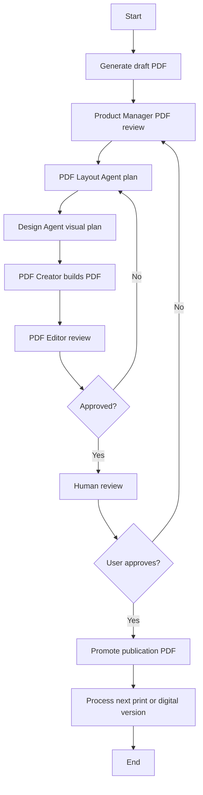

# W2 PDF Workflow Proposal

**Date:** 2024-11-23
**Author:** CEO
**Purpose:** Define the iterative PDF workflow for producing publication-quality digital and print PDFs.

---

## Context

This workflow runs after W1 produces updated content. It takes W1's artifacts (release notes, updated content) and produces publication-ready PDFs.

### Dependencies
- **Prework complete:** Book registry, workflow lifecycle, event system, artifact sharing
- **W1 artifacts:** Release notes, updated print HTML
- **Existing pipelines:** PDF generation at `src/tooling/pdf-gen`

---

## Goal

Produce publication-quality digital and print PDFs for distribution.

---

## Workflow Diagram



---

## Process Steps

1. Generate draft PDF from W1 artifacts
2. Product Manager reviews draft and release notes
3. PDF Layout Agent builds structural plan
4. Design Agent builds visual plan and creates image prompts
5. PDF Creator updates templates and builds new PDF
6. PDF Editor checks correctness and quality
7. If rejected, return to needed step
8. If approved, human review decides final acceptance
9. If rejected, iterate again
10. If approved, produce final PDF
11. Process the other version (digital/print)
12. Promote and version both

---

## Agents

All agents follow the **prompt-based pattern** (see `docs/developers/agent-architecture.md`):
1. CLI generates prompt files with full context
2. Claude Code reads prompts and executes tasks
3. Results saved via `--save` subcommands

### Product Manager Agent

**Prompt Generator:** `generatePdfPmPrompt(context)`

**Inputs:**
- Draft PDF path
- Release notes from W1

**Outputs:**
- PDF improvement plan JSON

**CLI:**
```bash
pnpm w2:pm-review --run=<id>           # Generate prompt
pnpm w2:pm-review --save --run=<id> --plan=<path>  # Save result
```

---

### PDF Layout Agent

**Prompt Generator:** `generateLayoutPrompt(context)`

**Inputs:**
- Improvement plan

**Outputs:**
- Structural layout plan JSON

**CLI:**
```bash
pnpm w2:layout --run=<id>              # Generate prompt
pnpm w2:layout --save --run=<id> --plan=<path>     # Save result
```

---

### Design Agent

**Prompt Generator:** `generateDesignPrompt(context)`

**Inputs:**
- Layout plan

**Outputs:**
- Design plan JSON
- Image asset prompts

**CLI:**
```bash
pnpm w2:design --run=<id>              # Generate prompt
pnpm w2:design --save --run=<id> --plan=<path>     # Save result
```

---

### PDF Creator Agent

**Prompt Generator:** `generatePdfCreatorPrompt(context)`

**Inputs:**
- Layout plan
- Design plan
- Assets folder path

**Outputs:**
- New generated PDF path

**CLI:**
```bash
pnpm w2:create-pdf --run=<id>          # Generate prompt
pnpm w2:create-pdf --save --run=<id> --pdf=<path>  # Save result
```

---

### PDF Editor Agent

**Prompt Generator:** `generatePdfEditorPrompt(context)`

**Inputs:**
- PDF document path

**Outputs:**
- Approval report JSON
- Screenshots paths

**CLI:**
```bash
pnpm w2:editor-review --run=<id>       # Generate prompt
pnpm w2:editor-review --save --run=<id> --result=<path>  # Save result
```

---

## Data I/O

### Inputs
- W1 artifacts (release notes, print HTML)
- Draft PDF
- Design assets
- Input version ID from W1

### Outputs
- Digital publication PDF
- Print publication PDF
- Output version ID in `book_versions`

---

## Workflow Artifacts

| Artifact Type | Description |
|--------------|-------------|
| `pdf_draft` | Draft PDF for review |
| `pdf_digital` | Final digital PDF |
| `pdf_print` | Final print PDF |
| `layout_plan` | Structural layout document |
| `design_plan` | Visual design document |

---

## Success Criteria

1. **PDF generation works** - Can produce PDF from W1 artifacts
2. **Agent handoffs work** - PM → Layout → Design → Creator → Editor cycle
3. **Both versions produced** - Digital and print PDFs generated
4. **Quality gates pass** - Editor and human review approve
5. **Artifacts registered** - All outputs in workflow_artifacts

---

## Risks

1. **Image generation inconsistency** - AI-generated images may not match style
   - Mitigation: Design Agent creates detailed prompts, human review gate

2. **PDF rendering issues** - Complex layouts may break
   - Mitigation: PDF Editor checks structure before approval

3. **Version mismatch** - Digital vs print versions diverge
   - Mitigation: Both versions from same source, sequential processing

---

## Strategic Command

Once all individual W2 commands are implemented, create a single entry-point command that orchestrates the entire workflow with persistent state:

### Usage

```bash
# Start new W2 workflow from W1 artifacts
pnpm w2:strategic --book=core-rulebook --from-w1=<w1-plan-id>

# Resume existing W2 workflow
pnpm w2:strategic --resume=<plan-id>

# List W2 strategic plans
pnpm w2:strategic --list
```

### Behavior

1. **Creates strategic plan** - Saves to database with unique ID (e.g., `strat_w2_abc123`)
2. **Saves state to artifacts** - `data/w2-strategic/{plan_id}/strategy.json` and `state.json`
3. **Outputs orchestration prompt** - Claude Code reads and executes the workflow
4. **Tracks progress** - State updated after each step for crash recovery
5. **Human gate** - Stops for approval before final PDF promotion

### State Tracking

```json
{
  "current_phase": "layout|design|creation|review|human_gate|complete",
  "current_version": "digital|print",
  "iterations": 1,
  "last_updated": "2024-01-15T10:30:00Z"
}
```

### Recovery

If a session crashes, `--resume` generates a new prompt that reads saved state and continues from where it left off.

---

## Implementation Notes

### Module Structure

```
src/tooling/w2/
├── prompt-generator.ts    # All W2 prompt generators
├── prompt-writer.ts       # W2PromptWriter class
├── result-saver.ts        # W2ResultSaver class
└── index.ts               # Exports

src/tooling/cli-commands/
├── w2-pm-review.ts        # PM review CLI
├── w2-layout.ts           # Layout planning CLI
├── w2-design.ts           # Design planning CLI
├── w2-create-pdf.ts       # PDF creation CLI
├── w2-editor-review.ts    # Editor review CLI
└── w2-finalize.ts         # Finalization orchestrator
```

### Prompt Files Location

```
data/w2-prompts/{runId}/
├── pm-review.txt          # PM review prompt
├── layout-plan.txt        # Layout planning prompt
├── design-plan.txt        # Design planning prompt
├── pdf-creator.txt        # PDF creator prompt
└── editor-review.txt      # Editor review prompt
```

### Reference

See `docs/developers/agent-architecture.md` for the complete prompt-based agent pattern.

---

*This proposal is input for a W2 Boardroom session.*
