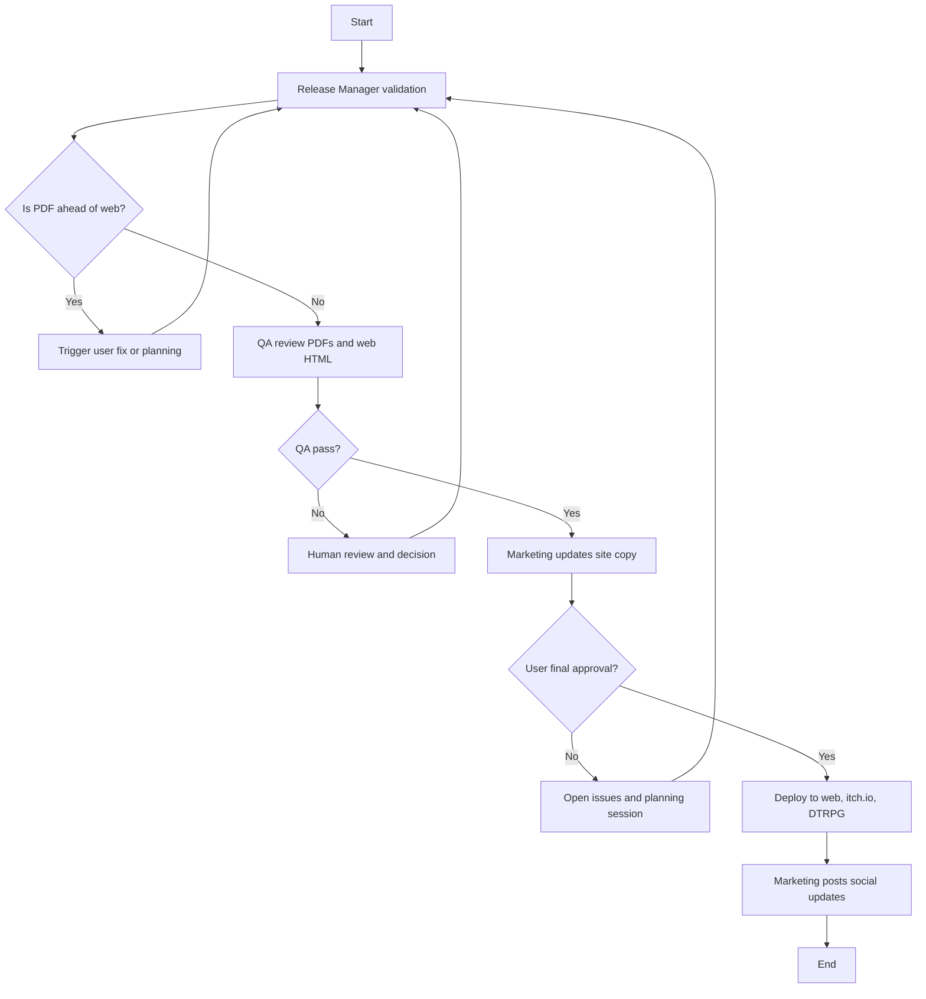

# W3 Publication Workflow Proposal

**Date:** 2024-11-23
**Author:** CEO
**Purpose:** Define the publication workflow for deploying approved content to web, itch.io, and DriveThruRPG.

---

## Context

This workflow runs after W1 and W2 produce approved content and PDFs. It handles the final publication and deployment to all distribution channels.

### Dependencies
- **Prework complete:** Book registry, workflow lifecycle, event system, artifact sharing
- **W1 artifacts:** Updated web HTML, release notes
- **W2 artifacts:** Publication PDFs (digital and print)

---

## Goal

Publish approved PDFs and deploy updated content to the web, itch.io, and DriveThruRPG.

---

## Workflow Diagram



---

## Process Steps

1. Release Manager verifies version alignment
2. Confirm web HTML is not behind PDFs
3. QA checks for defects in PDFs and web HTML
4. If QA fails, human decides next steps
5. If QA passes, Marketing updates website content
6. User provides final approval
7. If rejected, re-plan
8. If approved, Deploy Agent performs final deployment
9. Marketing posts release announcements

---

## Agents

All agents follow the **prompt-based pattern** (see `docs/developers/agent-architecture.md`):
1. CLI generates prompt files with full context
2. Claude Code reads prompts and executes tasks
3. Results saved via `--save` subcommands

### Release Manager Agent

**Prompt Generator:** `generateReleaseManagerPrompt(context)`

**Inputs:**
- W1 artifacts (web HTML, release notes)
- W2 artifacts (PDFs)
- Current production versions

**Outputs:**
- Version alignment report JSON
- Release readiness status

**CLI:**
```bash
pnpm w3:release-check --run=<id>       # Generate prompt
pnpm w3:release-check --save --run=<id> --report=<path>  # Save result
```

---

### QA Agent

**Prompt Generator:** `generateQaPrompt(context)`

**Inputs:**
- PDFs (digital and print)
- Web HTML

**Outputs:**
- QA report JSON
- Pass/fail status
- Defect list (if any)

**CLI:**
```bash
pnpm w3:qa --run=<id>                  # Generate prompt
pnpm w3:qa --save --run=<id> --report=<path>  # Save result
```

---

### Marketing Agent

**Prompt Generator:** `generateMarketingPrompt(context)`

**Inputs:**
- Release notes
- Current website content

**Outputs:**
- Updated website copy
- Social media announcements

**CLI:**
```bash
pnpm w3:marketing --run=<id>           # Generate prompt
pnpm w3:marketing --save --run=<id> --content=<path>  # Save result
```

---

### Deploy Agent

**Prompt Generator:** `generateDeployPrompt(context)`

**Inputs:**
- Approved PDFs
- Approved web HTML
- Deployment manifest

**Outputs:**
- Deployment status JSON
- Published URLs

**CLI:**
```bash
pnpm w3:deploy --run=<id>              # Generate prompt
pnpm w3:deploy --save --run=<id> --status=<path>  # Save result
```

---

## Data I/O

### Inputs
- W1 artifacts (web HTML, release notes)
- W2 artifacts (digital PDF, print PDF)
- Current production state

### Outputs
- Deployed web content
- Published PDFs on distribution platforms
- Social media posts
- Updated production state

---

## Workflow Artifacts

| Artifact Type | Description |
|--------------|-------------|
| `deployment` | Deployment manifest |
| `qa_report` | QA findings |
| `marketing_copy` | Updated website content |
| `announcement` | Social media posts |

---

## Deployment Targets

| Platform | Content | Method |
|----------|---------|--------|
| razorweave.com | Web HTML, PDFs | Git deploy / Vercel |
| itch.io | Digital PDF | itch.io API |
| DriveThruRPG | Print PDF, Digital PDF | DTRPG publisher portal |

---

## Success Criteria

1. **Version alignment verified** - No content mismatch between channels
2. **QA passes** - No critical defects
3. **All platforms deployed** - Web, itch.io, DTRPG updated
4. **Announcements posted** - Social media updated
5. **Production state updated** - Database reflects new versions

---

## Risks

1. **Version mismatch** - Different versions on different platforms
   - Mitigation: Release Manager validates alignment before deploy

2. **Deployment failures** - Platform APIs may fail
   - Mitigation: Retry logic, manual fallback procedures

3. **Rollback complexity** - Hard to undo multi-platform release
   - Mitigation: Human approval gate before deploy, version tracking

---

## Strategic Command

Once all individual W3 commands are implemented, create a single entry-point command that orchestrates the entire workflow with persistent state:

### Usage

```bash
# Start new W3 workflow from W1+W2 artifacts
pnpm w3:strategic --book=core-rulebook --from-w2=<w2-plan-id>

# Resume existing W3 workflow
pnpm w3:strategic --resume=<plan-id>

# List W3 strategic plans
pnpm w3:strategic --list
```

### Behavior

1. **Creates strategic plan** - Saves to database with unique ID (e.g., `strat_w3_abc123`)
2. **Saves state to artifacts** - `data/w3-strategic/{plan_id}/strategy.json` and `state.json`
3. **Outputs orchestration prompt** - Claude Code reads and executes the workflow
4. **Tracks progress** - State updated after each step for crash recovery
5. **Human gate** - Stops for final approval before deployment to all platforms

### State Tracking

```json
{
  "current_phase": "release_check|qa|marketing|human_gate|deploy|announce|complete",
  "platforms_deployed": [],
  "qa_passed": false,
  "last_updated": "2024-01-15T10:30:00Z"
}
```

### Recovery

If a session crashes, `--resume` generates a new prompt that reads saved state and continues from where it left off. Critical for W3 since partial deployments need careful handling.

---

## Implementation Notes

### Module Structure

```
src/tooling/w3/
├── prompt-generator.ts    # All W3 prompt generators
├── prompt-writer.ts       # W3PromptWriter class
├── result-saver.ts        # W3ResultSaver class
└── index.ts               # Exports

src/tooling/cli-commands/
├── w3-release-check.ts    # Release manager CLI
├── w3-qa.ts               # QA review CLI
├── w3-marketing.ts        # Marketing content CLI
├── w3-deploy.ts           # Deployment CLI
└── w3-finalize.ts         # Finalization orchestrator
```

### Prompt Files Location

```
data/w3-prompts/{runId}/
├── release-check.txt      # Release manager prompt
├── qa-review.txt          # QA review prompt
├── marketing.txt          # Marketing content prompt
└── deploy.txt             # Deployment prompt
```

### Reference

See `docs/developers/agent-architecture.md` for the complete prompt-based agent pattern.

---

*This proposal is input for a W3 Boardroom session.*
