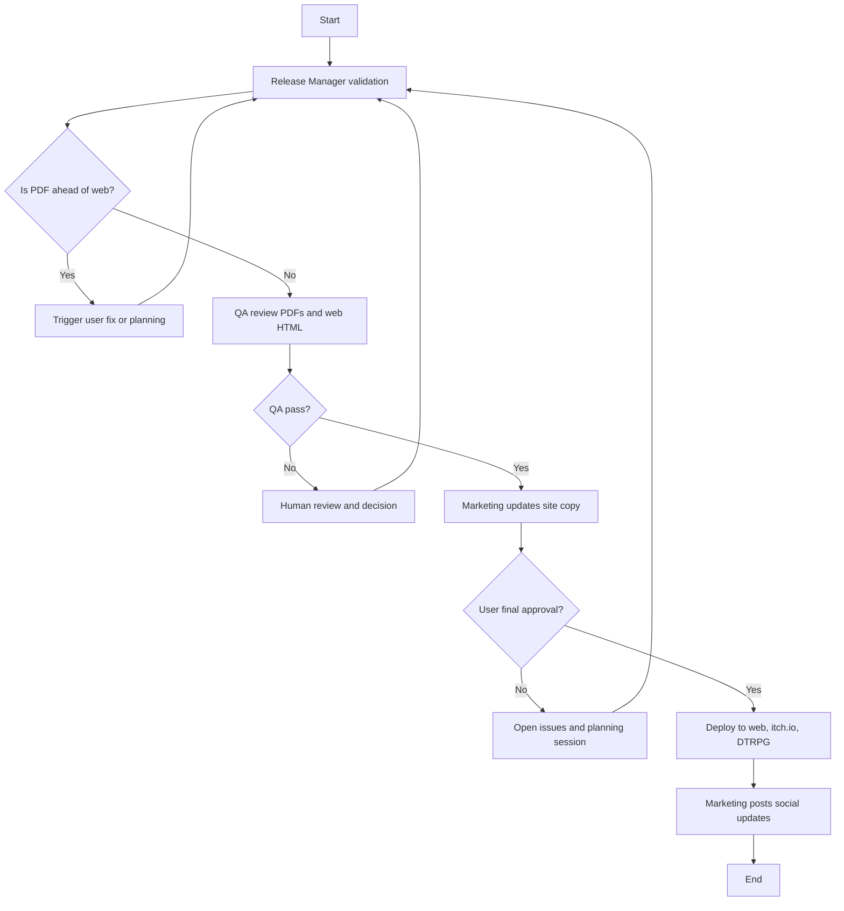

# W3 Publication Workflow Proposal

**Date:** 2024-11-23
**Author:** CEO
**Purpose:** Define the publication workflow for deploying approved content to web, itch.io, and DriveThruRPG.

---

## Context

This workflow runs after W1 and W2 produce approved content and PDFs. It handles the final publication and deployment to all distribution channels.

### Dependencies
- **Prework complete:** Book registry, workflow lifecycle, event system, artifact sharing
- **W1 artifacts:** Updated web HTML, release notes
- **W2 artifacts:** Publication PDFs (digital and print)

---

## Goal

Publish approved PDFs and deploy updated content to the web, itch.io, and DriveThruRPG.

---

## Workflow Diagram

---

## Process Steps

1. Release Manager verifies version alignment
2. Confirm web HTML is not behind PDFs
3. QA checks for defects in PDFs and web HTML
4. If QA fails, human decides next steps
5. If QA passes, Marketing updates website content
6. User provides final approval
7. If rejected, re-plan
8. If approved, Deploy Agent performs final deployment
9. Marketing posts release announcements

---

## Agents

### Release Manager Agent

**Inputs:**
- W1 artifacts (web HTML, release notes)
- W2 artifacts (PDFs)
- Current production versions

**Outputs:**
- Version alignment report
- Release readiness status

**Responsibilities:**
- Validate version alignment
- Check release readiness

---

### QA Agent

**Inputs:**
- PDFs (digital and print)
- Web HTML

**Outputs:**
- QA report
- Pass/fail status
- Defect list (if any)

**Responsibilities:**
- Check PDFs for structure and errors
- Check web HTML for issues

---

### Marketing Agent

**Inputs:**
- Release notes
- Current website content

**Outputs:**
- Updated website copy
- Social media announcements

**Responsibilities:**
- Update website content
- Write release announcements

---

### Deploy Agent

**Inputs:**
- Approved PDFs
- Approved web HTML
- Deployment credentials

**Outputs:**
- Deployment status
- Published URLs

**Responsibilities:**
- Deploy to razorweave.com
- Deploy to itch.io
- Deploy to DriveThruRPG

---

## Data I/O

### Inputs
- W1 artifacts (web HTML, release notes)
- W2 artifacts (digital PDF, print PDF)
- Current production state

### Outputs
- Deployed web content
- Published PDFs on distribution platforms
- Social media posts
- Updated production state

---

## Workflow Artifacts

| Artifact Type | Description |
|--------------|-------------|
| `deployment` | Deployment manifest |
| `qa_report` | QA findings |
| `marketing_copy` | Updated website content |
| `announcement` | Social media posts |

---

## Deployment Targets

| Platform | Content | Method |
|----------|---------|--------|
| razorweave.com | Web HTML, PDFs | Git deploy / Vercel |
| itch.io | Digital PDF | itch.io API |
| DriveThruRPG | Print PDF, Digital PDF | DTRPG publisher portal |

---

## Success Criteria

1. **Version alignment verified** - No content mismatch between channels
2. **QA passes** - No critical defects
3. **All platforms deployed** - Web, itch.io, DTRPG updated
4. **Announcements posted** - Social media updated
5. **Production state updated** - Database reflects new versions

---

## Risks

1. **Version mismatch** - Different versions on different platforms
   - Mitigation: Release Manager validates alignment before deploy

2. **Deployment failures** - Platform APIs may fail
   - Mitigation: Retry logic, manual fallback procedures

3. **Rollback complexity** - Hard to undo multi-platform release
   - Mitigation: Human approval gate before deploy, version tracking

---

*This proposal is input for a W3 Boardroom session.*
