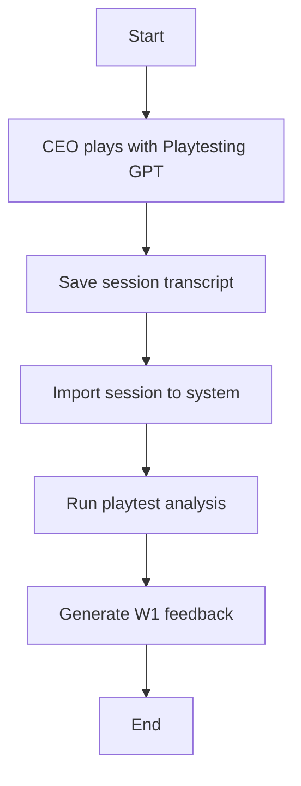
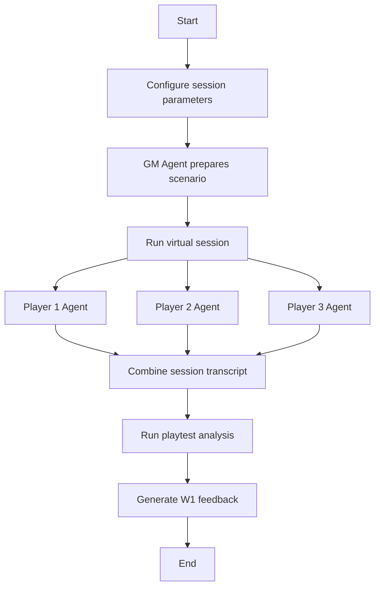

# W4 Playtesting Workflow Proposal

**Date:** 2024-11-23
**Author:** CEO
**Purpose:** Define the playtesting workflow for gathering gameplay feedback through both human GPT sessions and agentic virtual sessions.

---

## Context

This workflow runs after the core book is fully published (W3 complete). It provides ongoing feedback to improve the game through actual play experience. Feedback feeds back into W1 for future editing cycles.

### Dependencies
- **Prework complete:** Book registry, workflow lifecycle, event system, artifact sharing
- **Core book published:** At least one complete W1→W2→W3 cycle
- **Custom GPT:** Playtesting GPT with access to core book and settings

---

## Goal

Gather gameplay feedback through dual-track playtesting:
1. **Human GPT Sessions** - CEO plays with custom GPT, captures session data
2. **Agentic Sessions** - Virtual GM + 3 Player agents run simulated sessions

Both tracks produce feedback that feeds into W1 for game improvements.

---

## Dual-Track Architecture

### Track A: Human GPT Playtesting



**Process:**
1. CEO conducts playtesting session with custom GPT
2. GPT has access to core book and setting information
3. Session transcript saved externally
4. `w4:import-session` imports transcript into system
5. Analysis agent extracts actionable feedback
6. Feedback registered as W1 input artifact

### Track B: Agentic Playtesting



**Process:**
1. Configure session (setting, scenario type, character types)
2. GM Agent prepares scenario using core book + setting
3. Three Player Agents create characters and play
4. Session runs with structured turn-taking
5. Full transcript captured
6. Analysis agent extracts actionable feedback
7. Feedback registered as W1 input artifact

---

## Agents

### GM Agent (Track B)

**Inputs:**
- Core book content
- Setting information (if applicable)
- Session parameters (scenario type, difficulty)

**Outputs:**
- Prepared scenario
- Session narrative
- GM observations

**Responsibilities:**
- Create engaging scenario
- Adjudicate rules
- Track narrative flow
- Note rule ambiguities or friction points

---

### Player Agents (Track B)

**Inputs:**
- Core book (character creation, rules)
- Setting information
- GM prompts

**Outputs:**
- Character sheets
- Player actions
- In-character responses

**Responsibilities:**
- Create diverse characters using different archetypes
- Make in-character decisions
- Engage with mechanics naturally
- Report confusion or friction points

---

### Playtest Analysis Agent (Both Tracks)

**Inputs:**
- Session transcript
- Core book reference
- Previous feedback history

**Outputs:**
- Playtest analysis report
- Categorized feedback items
- Severity ratings

**Responsibilities:**
- Identify rule ambiguities
- Note mechanical friction
- Highlight narrative successes
- Categorize issues (clarity, balance, fun)

---

### Feedback Generator Agent (Both Tracks)

**Inputs:**
- Playtest analysis
- Existing W1 backlog

**Outputs:**
- W1 feedback artifact
- Prioritized improvement suggestions

**Responsibilities:**
- Convert analysis into actionable W1 input
- De-duplicate with existing feedback
- Prioritize by severity and frequency

---

## Data I/O

### Inputs
- Core book content (current published version)
- Setting information
- Session parameters
- Human GPT transcripts (Track A)

### Outputs
- Session transcripts
- Playtest analysis reports
- W1 feedback artifacts

---

## Workflow Artifacts

| Artifact Type | Description |
|--------------|-------------|
| `playtest_session` | Full session transcript |
| `playtest_analysis` | Analysis report |
| `playtest_feedback` | W1-ready feedback items |

---

## Database Schema

```sql
-- Playtest sessions
playtest_sessions (
  id TEXT PRIMARY KEY,
  workflow_run_id TEXT REFERENCES workflow_runs,
  track TEXT NOT NULL,  -- 'human_gpt' | 'agentic'
  book_id TEXT REFERENCES books,
  setting_id TEXT,
  session_date TIMESTAMP,
  transcript TEXT,
  status TEXT,  -- 'imported' | 'analyzed' | 'feedback_generated'
  created_at TIMESTAMP
)

-- Playtest analysis results
playtest_analysis (
  id TEXT PRIMARY KEY,
  session_id TEXT REFERENCES playtest_sessions,
  category TEXT,  -- 'clarity' | 'balance' | 'fun' | 'mechanics'
  severity TEXT,  -- 'low' | 'medium' | 'high'
  finding TEXT,
  recommendation TEXT,
  created_at TIMESTAMP
)

-- Feedback items for W1
playtest_feedback (
  id TEXT PRIMARY KEY,
  analysis_id TEXT REFERENCES playtest_analysis,
  target_workflow TEXT DEFAULT 'w1_editing',
  priority INTEGER,
  description TEXT,
  status TEXT,  -- 'pending' | 'accepted' | 'rejected' | 'implemented'
  created_at TIMESTAMP
)
```

---

## CLI Commands

```bash
# Track A: Import human GPT session
pnpm w4:import-session --file <transcript.txt> --book <slug>

# Track B: Run agentic session
pnpm w4:run-session --book <slug> [--setting <slug>] [--scenario <type>]

# Analysis (both tracks)
pnpm w4:analyze --session <id>

# Generate W1 feedback
pnpm w4:generate-feedback --session <id>

# List sessions and feedback
pnpm w4:list [--status <status>]
```

---

## Success Criteria

1. **Human import works** - Can import GPT session transcripts
2. **Agentic sessions run** - GM + 3 Players complete a session
3. **Analysis extracts insights** - Meaningful feedback identified
4. **Feedback flows to W1** - Artifacts registered for W1 consumption
5. **Both tracks produce value** - Human and agentic feedback complement each other

---

## Risks

1. **Agentic sessions feel artificial** - Agents may not play naturally
   - Mitigation: Diverse player personas, randomized scenarios

2. **Feedback overload** - Too many items for W1 to process
   - Mitigation: Prioritization, de-duplication, severity filtering

3. **GPT limitations** - Custom GPT may not capture all nuances
   - Mitigation: Supplement with agentic sessions, iterate on GPT prompt

4. **Analysis quality** - May miss subtle issues
   - Mitigation: Human review of high-priority feedback

---

## Build Order Note

W4 is built **after** the core book completes its first full W1→W2→W3 cycle. The workflow is designed to provide ongoing improvement feedback for subsequent iterations.

---

*This proposal is input for a W4 Boardroom session.*
