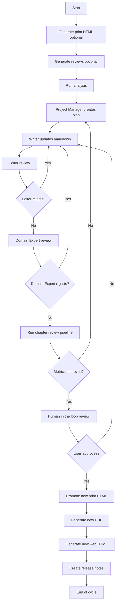
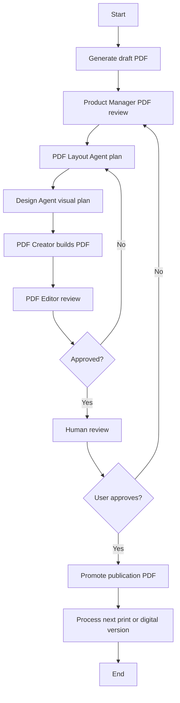
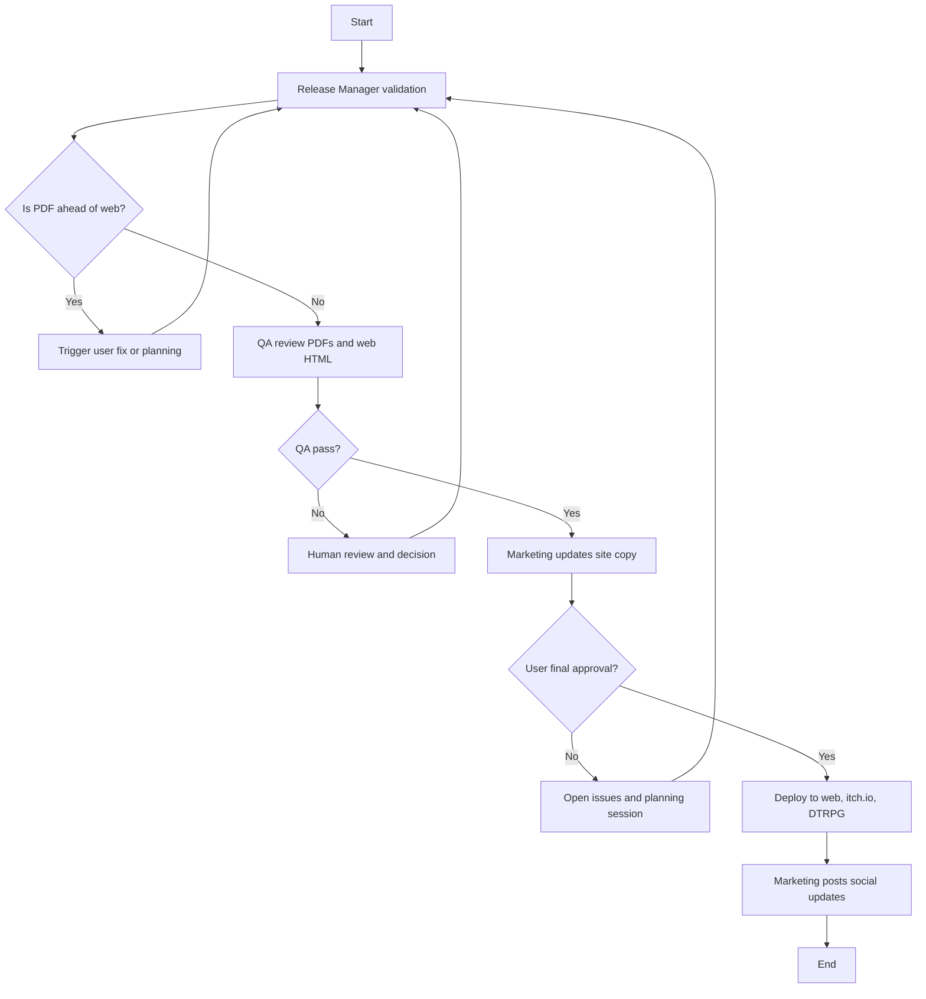
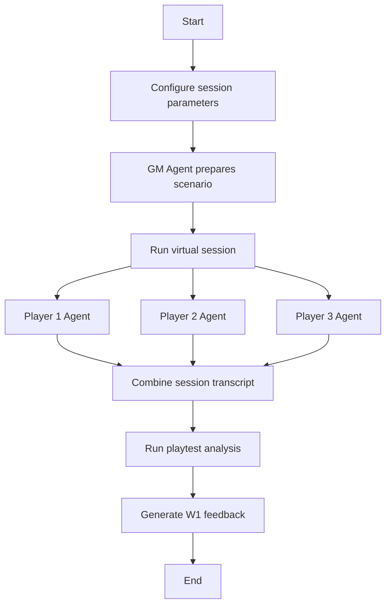

# Razorweave Master Plan
Full Combined Version
Includes Mermaid Diagrams, Workflow Descriptions, Agent Interfaces, and Data Specifications

---

# Context

You are a software engineer and project architect. Pipelines already exist for personas, reviews, html generation, and pdf generation. These pipelines live in the following locations:

- Personas at `src/tooling/personas`
- Reviews and analysis at `src/tooling/reviews`
- HTML generation at `src/tooling/html-gen`
- PDF generation at `src/tooling/pdf-gen`

The pipelines are executed through scripts in `package.json`.
The goal is to build multi agent workflows that Claude Code can run reliably.
Each workflow requires a design document, clear agent roles, and consistent data flows.
All workflows read and write to `data/project.db`.
Pipelines must produce console output that guides Claude Code to the next step.

---

# Build Order

```
Prework → W1 → W2 → W3 → (publish core book) → W4
                ↑__________________________|
                (W4 feedback loops back to W1)
```

| Phase | Name | Status | Proposal |
|-------|------|--------|----------|
| Prework | Schema Unification & Foundation | APPROVED | [prework.md](proposals/prework.md) |
| W1 | Iterative Editing | DRAFT | [w1-editing.md](proposals/w1-editing.md) |
| W2 | Iterative PDF | DRAFT | [w2-pdf.md](proposals/w2-pdf.md) |
| W3 | Publication | DRAFT | [w3-publication.md](proposals/w3-publication.md) |
| W4 | Playtesting | DRAFT | [w4-playtesting.md](proposals/w4-playtesting.md) |

---

# References

- Production website: https://razorweave.com
- GitHub: https://github.com/synth-rabbit/razor-weave
- Documentation: `docs/` or https://github.com/synth-rabbit/razor-weave/tree/main/docs

---

# Mermaid Diagram Standard

All workflows in this document include Mermaid flow charts.
These diagrams are the official visual representation and are intended to be rendered in GitHub, Obsidian, or any Mermaid capable viewer.

---

# Image Generation Guidelines

Image models snap to a small set of internal sizes:

- Landscape often returns close to 1536 x 1024
- Portrait often returns close to 1024 x 1536
- Square usually returns 1024 x 1024

For consistent results:

1. Request an aspect ratio
2. Or request the nearest supported size while preserving the ratio

---

# Prework
# Schema Unification & Foundation

## Goal

Establish shared infrastructure needed by all workflows before building W1/W2/W3/W4.

---

## What Prework Builds

1. **Unified Database Schema** - Single `data/project.db` with book registry, version linking
2. **Workflow Lifecycle Engine** - State machine for workflow execution tracking
3. **Event System** - Agent events, rejection tracking, smart routing
4. **Artifact Sharing** - Cross-workflow artifact registration and lookup
5. **Plan Lifecycle** - Automated plan status management

---

## Prework Phases

| Phase | Description |
|-------|-------------|
| 0 | Schema Unification & Foundation (7 milestones) |
| 1 | Book Registry Foundation |
| 2 | Workflow Lifecycle Engine |
| 3 | Event System & Smart Routing |
| 4 | Artifact Sharing Layer |
| 5 | Integration & Documentation |

See [Prework Approved Plan](generated/sess_687bc31b-summary.md) for full details.

---

# Workflow 1
# Iterative Editing Process

## Goal

Improve a book through review analysis, structured agent actions, and human oversight.

---

## Mermaid Flow Chart



---

## Process Description

1. Optionally generate the print HTML.
2. Optionally generate reviews. This includes:
   - Populating personas if needed
   - Running fifteen to fifty reviews
   - Running the analysis step
3. Project Manager creates an improvement plan based on the analysis.
4. Writer updates markdown files and reports changed chapters.
5. Editor reviews changes and approves or rejects.
6. Domain Expert reviews mechanical consistency and approves or rejects.
7. If either agent rejects, return to Project Manager and repeat steps.
8. If approved, run chapter level reviews.
9. Project Manager evaluates whether metrics improved.
10. If not, return to the review stage.
11. If yes, run a human review.
12. If the human reviewer rejects, iterate again.
13. If approved, promote new print HTML.
14. Generate and promote a new PDF draft.
15. Generate and promote new web HTML.
16. Create release notes.
17. Optionally generate a new review set.

---

# Workflow 1 Agent Interfaces

### Project Manager Agent

**Inputs**
- Review analysis
- Chapter list
- Prior release notes

**Outputs**
- Improvement plan
- Goal metrics

**Responsibilities**
- Convert analysis into actionable tasks
- Define success metrics

**Reads From**
- `data/reviews/analysis`
- `books/...`
- `data/project.db`

**Writes To**
- `data/workflow/pm/*`

---

### Writer Agent

**Inputs**
- Improvement plan
- Existing markdown files

**Outputs**
- Updated chapters
- Change log listing modified chapters

**Responsibilities**
- Implement improvements
- Enforce rules and style guides

---

### Editor Agent

**Inputs**
- Updated chapters
- PM plan goals
- Style guides

**Outputs**
- Editor review document
- Pass or fail flag

---

### Domain Expert Agent

**Inputs**
- Updated chapters
- Persona concerns
- Rule and mechanics guides

**Outputs**
- Review notes
- Approval status

---

# Workflow 1 Data I/O Summary

### Inputs
- Markdown sources
- Personas
- Style guides
- Print HTML

### Outputs
- Updated chapters
- Updated print HTML
- Updated PDF draft
- Updated web HTML
- Release notes

---

# Workflow 2
# Iterative PDF Process

## Goal

Produce publication quality digital and print PDFs for distribution.

---

## Mermaid Flow Chart



---

## Process Description

1. Generate draft PDF.
2. Product Manager reviews draft and release notes.
3. PDF Layout Agent builds structural plan.
4. Design Agent builds visual plan and creates prompts.
5. PDF Creator updates templates and builds new PDF.
6. PDF Editor checks correctness and quality.
7. If rejected, return to needed step.
8. If approved, human review decides final acceptance.
9. If rejected, iterate again.
10. If approved, produce final PDF.
11. Process the other version.
12. Promote and version both.

---

# Workflow 2 Agent Interfaces

### Product Manager Agent

**Inputs**
- Draft PDF
- Release notes

**Outputs**
- PDF improvement plan

---

### PDF Layout Agent

**Inputs**
- Improvement plan

**Outputs**
- Structural layout plan

---

### Design Agent

**Inputs**
- Layout plan

**Outputs**
- Design plan
- Image asset prompts

---

### PDF Creator Agent

**Inputs**
- Layout plan
- Design plan
- Assets folder

**Outputs**
- New generated PDF

---

### PDF Editor Agent

**Inputs**
- PDF document

**Outputs**
- Approval report
- Screenshots

---

# Workflow 3
# Publication Process

## Goal

Publish approved PDFs and deploy the updated content to the web, itch.io, and DriveThruRPG.

---

## Mermaid Flow Chart



---

## Process Description

1. Release Manager verifies version alignment.
2. Confirm web HTML is not behind PDFs.
3. QA checks for defects.
4. If QA fails, human decides next steps.
5. If QA passes, Marketing updates website content.
6. User provides final approval.
7. If rejected, re plan.
8. If approved, Deploy Agent performs final deployment.
9. Marketing posts release announcements.

---

# Workflow 3 Agent Interfaces

### Release Manager Agent
Validates versions and checks readiness.

### QA Agent
Checks pdfs and web html for structure and errors.

### Marketing Agent
Updates website content and writes announcements.

### Deploy Agent
Deploys final releases to all platforms.

---

# Workflow 4
# Playtesting Process

## Goal

Gather gameplay feedback through dual-track playtesting to improve the game.

---

## Dual-Track Architecture

### Track A: Human GPT Playtesting

CEO plays with custom GPT that has access to core book and settings. Session transcripts are imported for analysis.

### Track B: Agentic Playtesting

Virtual GM Agent + 3 Player Agents run simulated sessions. Full transcripts captured and analyzed.

---

## Mermaid Flow Chart (Track B)



---

## W4 Agent Interfaces

### GM Agent
Prepares scenarios, adjudicates rules, tracks narrative, notes friction points.

### Player Agents (3)
Create diverse characters, make in-character decisions, report confusion.

### Playtest Analysis Agent
Identifies rule ambiguities, notes mechanical friction, categorizes issues.

### Feedback Generator Agent
Converts analysis into W1-ready feedback items.

---

## Feedback Loop

W4 produces feedback artifacts that feed into W1 for future editing cycles:

```
W4 → playtest_feedback → W1 (next iteration)
```

---

# Combined Data Inputs and Outputs

## Workflow Inputs
- Markdown sources
- Print HTML
- Release notes
- Personas
- Style guides
- Design assets
- Playtest transcripts (W4)

## Workflow Outputs
- Updated markdown
- Updated print html
- Digital and print publication pdfs
- Promoted web html
- Release notes
- Published distribution packages
- Playtest feedback (W4)

---

# End of Document
